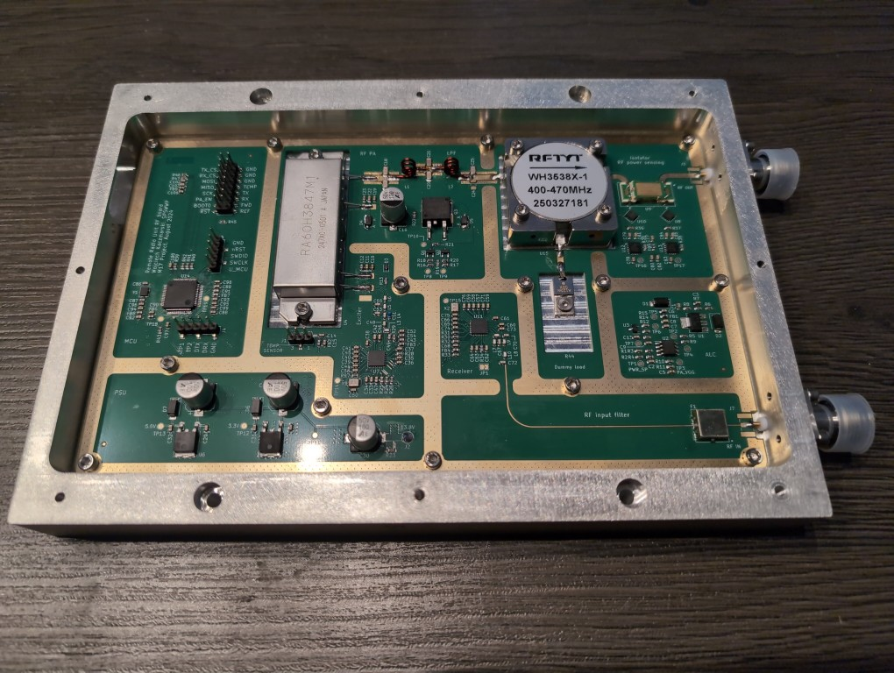

# RRU documentation

# The documentation moved to the [M17 Wiki](https://wiki.m17foundation.org/index.php?title=RRU_Setup)

This repository contains documentation for setting up the [Remote Radio Unit](https://github.com/M17-Project/rru-rf-hw) developed by SP5WWP for the M17 Project.

## Overview

These guides document my process for:
- Building and flashing the [RRU firmware](https://github.com/M17-Project/rru-rf-fw.git)
- Setting up a **Raspberry Pi 4** (replaces the [CM4 board](https://github.com/M17-Project/rru-cm4-hw.git) for now)
- Building and running [cari-host](https://github.com/M17-Project/cari-host.git) on the Raspberry Pi

My setup uses **Arch Linux** on the host PC and **Raspberry Pi OS (x64)** on the Raspberry Pi 4.

## Guides

### [Build and flash RRU firmware](build_and_flash_firmware.md)
- Connect STLink and USB-UART converter for debugging
- Build and flash the RRU firmware

### [Prepare Raspberry Pi](prepare_raspberry_pi.md)
- Connect the RRU to Raspberry Pi GPIOs
- Configure the internal serial port and user permissions

### [Build and use cari-host](build_and_use_cari_host.md)
- Install dependencies
- Build and install cari-host
- Connect to the RRU

### [Build and use cari-ctrl](cari-ctrl-grc.md) (Work in Progress)
- Build cari-ctrl
- Receive RRUs baseband via the ZMQ publisher provided by cari-host
- Plot eye diagram

## Additional resources
For more open source radio projects, visit [M17 Project](https://m17project.org/) and [M17 Foundation](https://m17foundation.org/).
