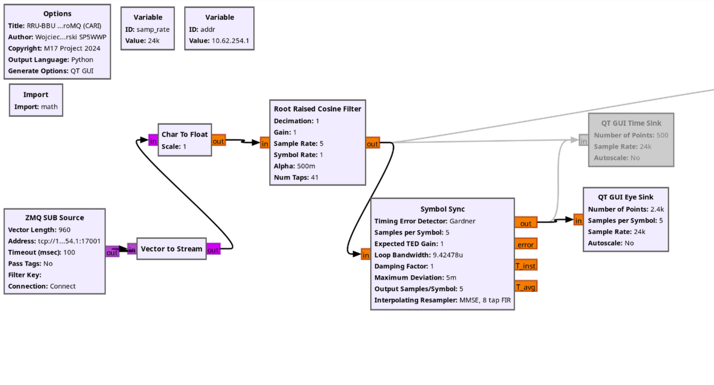
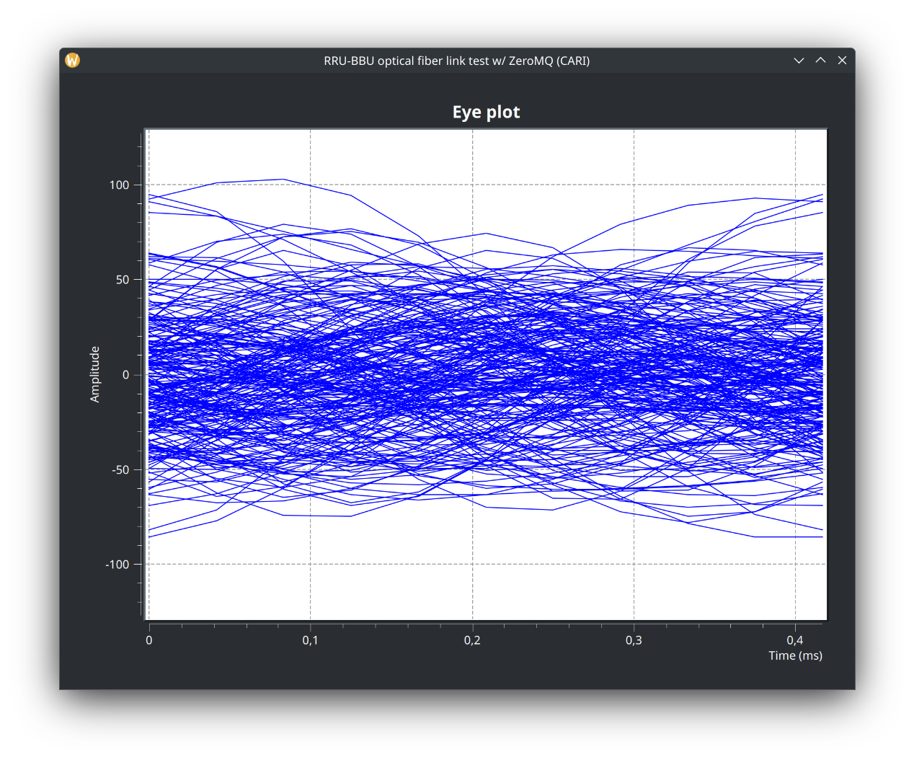
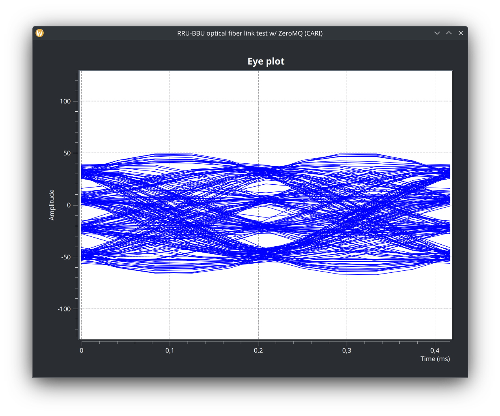

### Build and install cari-host on the PI


Work in Progress, PRs welcome

---

### Setup RRU / cari-host
Start cari-host on the RPI:

```
cari-host -p 27 -n 17 -b 22 -d 17001 -c 17002 -m 17003 -D /dev/ttyAMA0 -S 460800
```

Output should look like this:
```
GPIO init OK
Device reset OK
Initializing device /dev/ttyAMA0 at 460800 OK
Device's reply to PING OK
ZeroMQ downlink: tcp://*:17001 OK
ZeroMQ telemetry: tcp://*:17003 OK
ZeroMQ control: tcp://*:17002 OK
Listening for CARI commands...
```
---

### Set RX and TX frequencies and enable RX using cari-ctrl
Run cari-ctrl on your host PC
```
./cari-ctrl -d <RPI IP>:17002 -rf 430700000 -tf 438300000 -rx 1
```

The result should be:
```
RE REQ address: <RPI IP>:17002
RX frequency: 430700000 Hz
TX frequency: 438300000 Hz
ZMQ REQ connected
Setting RX freq to 430700000 Hz OK
Setting TX freq to 438300000 Hz OK
RX enable OK
Done, exiting.
```

You should see the commands sent and received in cari-hosts console output:
```
GPIO init OK
Device reset OK
Initializing device /dev/ttyAMA0 at 460800 OK
Device's reply to PING OK
ZeroMQ downlink: tcp://*:17001 OK
ZeroMQ telemetry: tcp://*:17003 OK
ZeroMQ control: tcp://*:17002 OK
Listening for CARI commands...
<- CMD 01, REP 00
<- CMD 02, REP 00
-> CMD 09, VAL 01
<- CMD 09, REP 00
```
---
The debug output over UART should look like this:
```
Remote Radio Unit (RRU) 420-450 MHz
FW v1.0.0 by Wojciech SP5WWP
RX IC: CC1200
TX IC: CC1200
Starting TRX config... done
RX PLL locked
TX PLL locked
[INTRFC_CMD] PING
[INTRFC_CMD] RX 431600000 Hz
[INTRFC_CMD] TX 438200000 Hz
[INTRFC_CMD] RX start
```
---

### Connect with Gnu Radio Companion
Now we are ready to receive the RRUs RX baseband using the zmq subscriber in Gnu Radio Companion and display it on an eyeplot.

Open the zmq_test in GNU radio companion, set the IP of the RPI and start it.



When you run it, you should see an eye plot, that looks like this:


First test receiving M17 from the RT3S:

