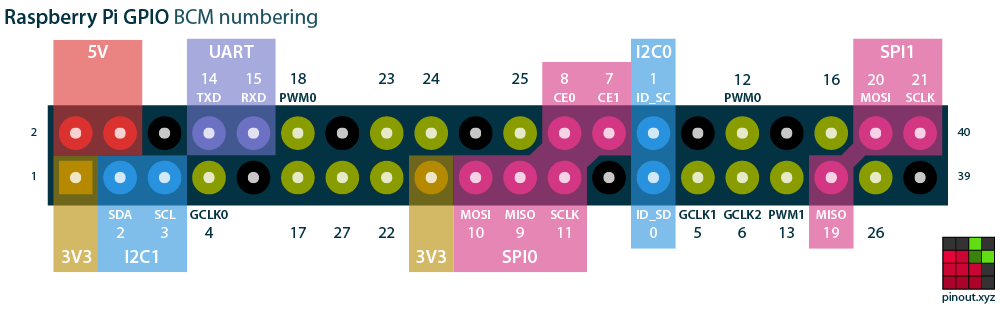

## Setup the Rapsberry PI 4:
### Configure the internal serial port:

Add user to dialout group:
```
sudo usermod -aG dialout $USER
newgrp dialout # or logoff / login
```

Disable serial console:
```bash
sudo systemctl stop serial-getty@ttyS0.service
sudo systemctl disable serial-getty@ttyS0.service
```

Set overlay:
This moves `/dev/ttyAMA0` to where UART RX/TX pins are (GPIO15/14).
```
# Backup the config file
sudo cp /boot/firmware/config.txt /boot/firmware/config.txt.bak
sudo sh -c "echo 'dtoverlay=miniuart-bt' >> /boot/firmware/config.txt"
```

Enable UART:
```bash
sudo raspi-config
# Select “Interface Options” > “Serial Port” to enable UART
# Login Shell -> No
# Hardware -> Yes
# Reboot
```

Check if the serial port is present:
```
ls -hal /dev/ttyAMA0
```

This should return something like this:
```bash
oe3anc@rru:~ $ ls -hal /dev/ttyAMA0    
crw-rw---- 1 root dialout 204, 64 Apr 25 10:12 /dev/ttyAMA0
```

### Connecting the Raspberry PI to the RRU

On the PI 4 i used these PINS:

| PI4 | RRU |
| --- | --- |
| 14  | TX  |
| 15  | RX  |
| 18  | PA  |
| GND | GND |


 (image by https://pinout.xyz/)

